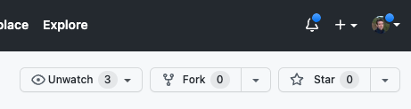
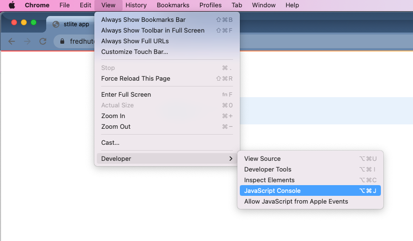
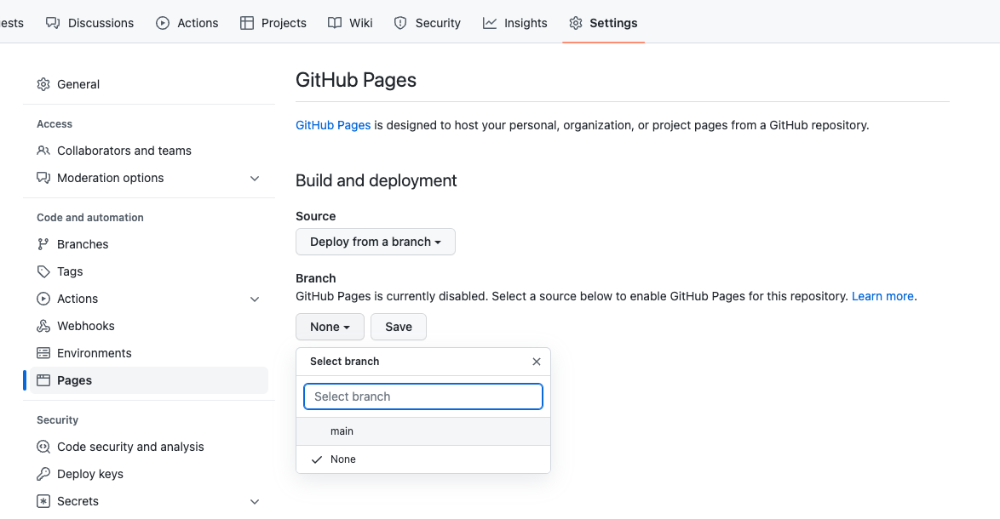

# Python-Based Data Viz (With No Installation Required)

## Write interactive apps in Python for non-computational users, without ever having to run a server

No matter what type of organization you work in, people working in data science
exist on a spectrum of computational skills and background. 
One of the biggest challenges for computationally-savvy researchers is how to most
effectively deliver useful tools to their less-computational colleagues.
While Python is an extremely powerful tool for data analysis and visualization, it
is not trivial for non-computational researchers to install and run python-based
apps on their own computers.

However, recent innovations in [WebAssembly](https://webassembly.org/) have made
it possible to run Python code **directly inside the web browser**.
Instead of having to keep a Python server running, you can now just set up a
static webpage which performs all of the needed computation directly on the user's
machine.
In this tutorial I will walk you through a few simple steps for setting up a
Python-based web app (using [Streamlit](https://streamlit.io/)) to be launched
by users _without having to install absolutely anything_.

## Weighing benefit and cost in data science

Working as a bioinformatician, I'm always on the lookout for new tools which can help
me perform really useful analyses for my collaborators.
But the decision to adopt a new tool is not purely based on what it can deliver -- 
I also have to weigh the difficulty of learning to use that new tool.
For a long time the world of web development felt like it was out of my reach purely
based on the apparent difficulty of learning JavaScript alongside HTML/CSS.

While it is true that Python (and R) can both be used to set up interactive
web apps, those libraries (Flask, Dash, Streamlit, and Shiny) are intended to
be run on active servers which perform all of the computation and then send the
results to the user's browser.
It is inherently much more difficult to run web apps in this way, both because
of the expense of keeping a machine constantly running as well as the complexity
of providing a protected network connection.
There are some wonderful hosted solutions for sharing R and Python based apps,
but it's complex enough that I'm not going to set up my own version.

## How it became possible

The transformational tool which profoundly changed the landscape of software
development has been [WebAssembly](https://webassembly.org/), which makes it
possible to compile Python code so that it can be run directly in a web browser.
Making code which runs in the web browser is fantastic because you no longer have
to ask a user to install any dependencies -- they almost certainly already have
a web browser.

The project which has implemented Python in JS is called [Pyodide](https://pyodide.org/en/stable/).
Using this framework, [Yuichiro Tachibana](https://github.com/whitphx) has
made a port of the Python GUI library [Streamlit](https://streamlit.io/)
called [stlite](https://github.com/whitphx/stlite).
Using stlite it is possible to write Python code which is run entirely in the
web browser, meaning that the user doesn't need to install anything for it to
run.

I may not have been as excited by this if I were not already a huge fan
of [Streamlit](https://streamlit.io/).
This Python library makes it extremely easy to build a simple GUI which
drives any sort of data visualization you like.
There is native integration with multiple powerful plotting libraries
(PyPlot, Altair, Vega Lite, Plotly, Bokeh, pydeck, and graphviz), as
well as flexible controls for user input, page layout, and media
display.
Most importantly the brainspace-overhead is low -- you don't have to learn
much to get started.
If you are already working in Python and want to quickly prototype and deploy
an interactive web app, it is definitely worth your time to explore
Streamlit.

And now, those Streamlit apps can be served to users and run directly in
the browser.

## Intended use and limitations

You can make an effective GUI using Python and stlite as long as you remember
that it is being run directly in the user's browser.

- It will take a minute to load -- your users will benefit from patience;
- Operations which require a large amount of memory, CPU, or I/O will likely cause problems --
try to keep the computation as lightweight as possible;
- Any files which you need to read in must also be available to the user's browser,
either by (1) hosting them yourself, (2) accessing them at a public URL, or (3)
when the user 'uploads' them into the browser;
- Access control matters -- anyone with access to the webpage will be able to run the app _and_ read its source.

## Getting started

This guide will walk you through:

1. Copying a template repository on GitHub
2. Adding your Streamlit app
3. Testing locally
4. Deploying publicly to the web with GitHub Pages

To use this guide you should have familiarity with (1) manipulating
software repositories on GitHub and (2) running Streamlit locally.

To get an idea of how a GitHub repository can be transformed into an
interactive data visualization app, you can see that this template
repository ([FredHutch/stlite-template](https://github.com/FredHutch/stlite-template))
has been hosted at [https://fredhutch.github.io/stlite-template/](https://fredhutch.github.io/stlite-template/).

### 1. Fork the template repository

Navigate to the [FredHutch/stlite-template](https://github.com/FredHutch/stlite-template)
repository and [fork it](https://docs.github.com/en/get-started/quickstart/fork-a-repo)
into your own account or organization.
Make sure to change the name and description, since you will be making
something entirely new.



### 2. Add your Streamlit app

All of the code needed to run your app should be placed in the repository.
Depending on what your app does, you may also need to take some additional
steps:

1. Place all of your Python/streamlit code in the file `app.py`;
2. Add any libraries which are imported by the app in line 25 of `index.html` (e.g. `requirements: ["click", "scipy", "plotly"],`);
3. If you have any `@st.cache` decorators in your streamlit app, add the argument `show_spinner=False` (to account for [a known bug in stlite](https://github.com/whitphx/stlite/issues/64))

### 2a. Reading in data

The trickiest part of this process that I ran into was how to read in
external data sources (e.g. CSV files).
Luckily, the solution didn't end up being too complex.

The core issue is that the `requests` library isn't currently supported
in Pyodide.
This leads to errors when using helpful functions like `pd.read_csv`,
which use `requests` behind the scenes. 
Instead, the best way to read in remote files from inside the browser
(keeping in mind that all files will be remote for your users, even
any additional files which you set up in your repository) is to use
the `pyodide.http` library.

However, the `pyodide` library isn't available when testing locally
inside Python, just as the `requests` library isn't usable when running
inside the browser.

To account for this, I made a small helper function which reads a CSV
from a URL using whichever library is appropriate to the execution context:

```{python}
import streamlit as st
import importlib
import requests
from io import StringIO
if importlib.util.find_spec("pyodide") is not None:
    from pyodide.http import open_url

@st.cache(show_spinner=False)
def read_url(url:str, **kwargs):
    """Read the CSV content from a URL"""

    # If pyodide is available
    if importlib.util.find_spec("pyodide") is not None:
        url_contents = open_url(url)
    else:
        r = requests.get(url)
        url_contents = StringIO(r.text)

    return pd.read_csv(
        url_contents,
        **kwargs
    )

```

Feel free to copy or modify this code as needed to read in the
data files you may need for your app.

### 2b. Staging data

The most interesting and useful apps process and transform data in
some way for display and interaction with the user.
When considering how to get data into your app, there are three
primary options:

1. Use data which is available at a public URL (as shown in
[the example repository](https://github.com/FredHutch/stlite-template));
2. Ask the user to upload the file directly using the
[streamlit file uploader utility](https://docs.streamlit.io/library/api-reference/widgets/st.file_uploader);
3. Host the data yourself, uploading it to the web in a location which can 
be accessed by the app.

While hosting the data yourself (option 3) may seem daunting, it is
actually made extremely easy using the steps outlined below for
publishing your app using GitHub Pages.
Once you publish your app to a particular URL, any additional files
which you've added to your repository will also be available at that
URL and can be read in by the app.
So if you want to add some data files which can be read in by the app,
follow this tutorial through to the end to figure out what URL it
will be available at, and then update your app to read from that URL.

### 3. Testing locally

Before deploying your app, it is extremely helpful to test it out
locally.
First, you can launch the app using your local copy of Python
(with streamlit installed) with:

```{shell}
streamlit run app.py
```

After debugging any errors which you find, the next step is to
launch a local web server to test your code directly in the
browser with:

```{shell}
python3 -m http.server
```

When checking for errors in the browser, it is always good to
open up the JavaScript Console (shown here in Chrome):



### 4. Deploying publicly to the web with GitHub Pages

While there are many ways to deploy a website, I find GitHub Pages
to be the easiest way to turn a code repository into a public
webpage.
Users who pay for Enterprise-level accounts can also create 
private websites, but anyone can create a public-facing page.

Just to be clear, even if your repository is private the published
webpage will still be public -- you have been warned.

To deploy to the web:

1. Navigate to the webpage for your repository (`www.github.com/<ORG>/<REPO>`);
2. Click on "Settings";
3. Click on "Pages" (under "Code and automation");
4. Under "Branch" select "main" (or whichever branch of the repo you would like to set up);
5. That's it!



You will soon be able to find your webpage at a URL which is
based on your organization and repository name (although there
are options to customize the domain name). E.g. `https://<ORG>.github.io/<REPO>/`.

For example, the template repository `https://github.com/FredHutch/stlite-template` is hosted as a webpage at `https://fredhutch.github.io/stlite-template/`.

Getting back to the explanation of uploading static data files, any
files which are added to the template repository could be read by
the app with that URL, e.g. `https://fredhutch.github.io/stlite-template/data_file.csv`.